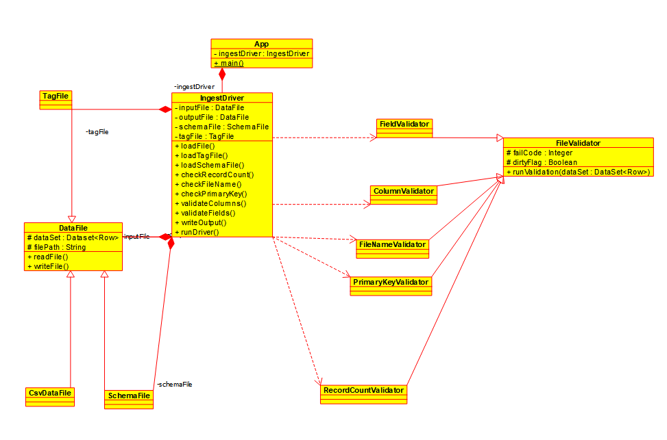
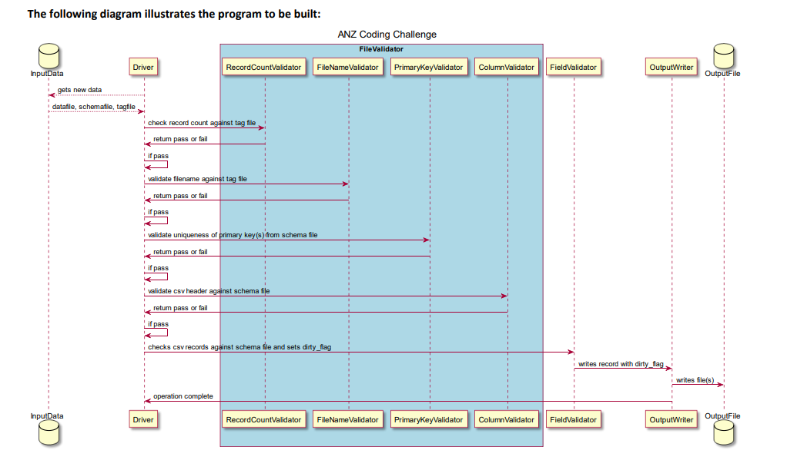

# Demo Java Data Framework Challenge

## Background

This repo contains the code base for a code challenge for building a Demo Data Ingestion framework using Java & Spark. The framework takes a csv file, a json schema and a tag file containing the csv file name and count as input. The framework validates the csv files based on various criteria and fails if some of them are not met and finally generates a output csv with 'dirty_flag' column to 
capture the data quality of the csv files.

## Requirements

The high level requirements are captured in the below Cucumber BDD scenarios. And are also implemented. All the required files can be found in `scenarios` directory.

### Specification 1 – File Integrity Checks

These checks typically involve comparing filenames, record counts and (optionally) checksums against the DATA. A Primary Key check will also help mitigate extraction issues that may have occurred at the source.

```

Feature: File Integrity checks

These checks are typically performed to ensure that the file
received from a source system is wholly complete.

  Scenario: Valid file - all checks are successful
    Given I have a DATA file named "scenarios/aus-capitals.csv"
      And I have a TAG file named "scenarios/aus-capitals.tag"
      And I have a SCHEMA file named "scenarios/aus-capitals.json"
     When I execute the application with output "output/sbe-1-1.csv"
     Then the program should exit with RETURN CODE of "0"
  Scenario: Invalid file - record count does not match
    Given I have a DATA file named "scenarios/aus-capitals.csv"
      And I have a TAG file named "scenarios/aus-capitals-invalid-1.tag"
      And I have a SCHEMA file named "scenarios/aus-capitals.json"
     When I execute the application with output "output/sbe-1-2.csv"
     Then the program should exit with RETURN CODE of "1"
  Scenario: Invalid file - file name does not match
    Given I have a DATA file named "scenarios/aus-capitals.csv"
      And I have a TAG file named "scenarios/aus-capitals-invalid-2.tag"
      And I have a SCHEMA file named "scenarios/aus-capitals.json"
     When I execute the application with output "output/sbe-1-3.csv"
     Then the program should exit with RETURN CODE of "2"
  Scenario: Invalid file - primary key test fail
    Given I have a DATA file named "scenarios/aus-capitals-dupes.csv"
      And I have a TAG file named "scenarios/aus-capitals-dupes.tag"
      And I have a SCHEMA file named "scenarios/aus-capitals.json"
     When I execute the application with output "output/sbe-1-4.csv"
     Then the program should exit with RETURN CODE of "3"
  Scenario: Invalid file - missing columns
    Given I have a DATA file named "scenarios/aus-capitals-missing.csv"
      And I have a TAG file named "scenarios/aus-capitals-missing.tag"
      And I have a SCHEMA file named "scenarios/aus-capitals.json"
     When I execute the application with output "output/sbe-1-5.csv"
     Then the program should exit with RETURN CODE of "4"
  Scenario: Invalid file - additional columns
    Given I have a DATA file named "scenarios/aus-capitals-addition.csv"
      And I have a TAG file named "scenarios/aus-capitals-addition.tag"
      And I have a SCHEMA file named "scenarios/aus-capitals.json"
     When I execute the application with output "output/sbe-1-6.csv"
     Then the program should exit with RETURN CODE of "4"

```

### Specification 2 – Field Integrity Checks

These tests check the shape of the data and ensure that it meets the agreed Interface  Specification (also known as an Interface Agreement) between a source and a consumer  of the source. Its sole aim is to ensure that all columns are accounted for, and that each value conforms to the datatype as specified in the agreement.

The data is enhanced via the additional of a new column indicating whether that  row has met the quality checks. This column is called the dirty_flag as is either set to  '0' (all checks have passed) or '1' (one or more values do not conform to the spec.

```

Feature: Field (Data) Integrity checks
These tests are typically performed to test the quality of the data

  Scenario: Valid fields
    Given I have a DATA named "scenarios/aus-capitals.csv"
      And I have a Data TAG file named "scenarios/aus-capitals.tag"
      And I have a Data SCHEMA file named "scenarios/aus-capitals.json"
     When I execute the Data application with output "output/act-sbe2-1.csv"
     Then the program should exist with RETURN CODE of 0
      And "output/act-sbe2-1.csv" should match "scenarios/exp-sbe2-1.csv"
  Scenario: Invalid fields
    Given I have a DATA named "scenarios/aus-capitals-invalid-3.csv"
      And I have a Data TAG file named "scenarios/aus-capitals-invalid-3.tag"
      And I have a Data SCHEMA file named "scenarios/aus-capitals.json" 
     When I execute the Data application with output "output/act-sbe2-2.csv"
     Then the program should exist with RETURN CODE of 0
      And "output/act-sbe2-2.csv" should match "scenarios/exp-sbe2-2.csv"

```

Below details some common terminology provided as part of the requirement.

### Tag File

All source systems provide both DATA and TAG files. The TAG file contains information that can validate the integrity of the DATA file, and typically contains a combination of the file name, record counts, extract dates, file checksum. If any checks fail, then a file is rejected as it can 
no longer be treated as a valid and trusted extract.

### Schema File

We are using JSON to describe the structure the data must adhere to. It is comprised of 2 root attributes `columns` and `primary_key`

Columns have the following attributes:

```

name: The name of the column matching the header

type: The data type for that cell.
It can be only one of:
- STRING
- INTEGER
- FLOAT
- DATE
format: Any format information specific to the type. This is an optional field
- Note, for DATE assume this will be defined as SimpleDateFormat
mandatory: Boolean. True means the value cannot be blank.

```

The `primary_key` attribute will be an ordered list of column names that make up a primary key.

## How to get the code

You can run the below git command to clone it to you local directory

```

git clone https://github.com/bobquest33/anz__data_framework_challenge.git

```

## How to Build

You can build the code using the below maven command.

```

mvn clean compile assembly:single

```

This will generate the jar `target/anz-code-challenge-1.0-SNAPSHOT-jar-with-dependencies.jar`

## How to Run the code

_Note: This code has been tested only in local environment please point to the appropriate env variables or pass the appropriate jvm options before running the jar_

I have captured the commands based on the above requirements and have successfully tested based on the scenarios. Please make necessary changes based on your requirement.

In the below scenarios:
- `-data` refers to the input file
- `-jar` points to the fat jar build earlier
- `-tag` points to the Tag file which contains the input csv file name and number of records
- `-schema` points to the json schema file which contains `columns` with constraints and data type information. And also `primary_keys` which lists the list of columns that forms the primary key.
- `-output` This points to the path where output csv file will be written to.

Please note for cases where the exit code is non-zero the output file will not be generated.

Run examples:


```
Scenario 1: Valid file – all checks are successful
java -Dspark.master=local -Dspark.sql.legacy.timeParserPolicy=LEGACY -jar target/anz-code-challenge-1.0-SNAPSHOT-jar-with-dependencies.jar -data scenarios/aus-capitals.csv -tag scenarios/aus-capitals.tag -schema scenarios/aus-capitals.json -output output/sbe-1-1.csv > ../op.txt
Exit code: 0

Scenario 2:  Invalid file – record count does not match
java -Dspark.master=local -Dspark.sql.legacy.timeParserPolicy=LEGACY  -jar target/anz-code-challenge-1.0-SNAPSHOT-jar-with-dependencies.jar -data scenarios/aus-capitals.csv -tag scenarios/aus-capitals-invalid-1.tag -schema scenarios/aus-capitals.json -output output/sbe-1-2.csv > ../op.txt
Exit code: 1

Scenario 3:  Invalid file –  file name does not match
java -Dspark.master=local -Dspark.sql.legacy.timeParserPolicy=LEGACY  -jar target/anz-code-challenge-1.0-SNAPSHOT-jar-with-dependencies.jar -data scenarios/aus-capitals.csv -tag scenarios/aus-capitals-invalid-2.tag -schema scenarios/aus-capitals.json -output output/sbe-1-3.csv > ../op.txt
Exit code: 2

Scenario 4:  Invalid file –  primary key test fail
java -Dspark.master=local -Dspark.sql.legacy.timeParserPolicy=LEGACY  -jar target/anz-code-challenge-1.0-SNAPSHOT-jar-with-dependencies.jar -data scenarios/aus-capitals-dupes.csv -tag scenarios/aus-capitals-dupes.tag -schema scenarios/aus-capitals.json -output output/sbe-1-4.csv > ../op.txt
Exit code: 3

Scenario 5:  Invalid file – missing columns
java -Dspark.master=local -Dspark.sql.legacy.timeParserPolicy=LEGACY  -jar target/anz-code-challenge-1.0-SNAPSHOT-jar-with-dependencies.jar -data scenarios/aus-capitals-missing.csv -tag scenarios/aus-capitals-missing.tag -schema scenarios/aus-capitals.json -output output/sbe-1-5.csv > ../op.txt
Exit code: 4

Scenario 6:  Invalid file – additional columns
java -Dspark.master=local -Dspark.sql.legacy.timeParserPolicy=LEGACY  -jar target/anz-code-challenge-1.0-SNAPSHOT-jar-with-dependencies.jar -data scenarios/aus-capitals-addition.csv -tag scenarios/aus-capitals-addition.tag -schema scenarios/aus-capitals.json -output output/sbe-1-6.csv > ../op.txt
Exit code: 4

Scenario 7:  Valid fields
java -Dspark.master=local -Dspark.sql.legacy.timeParserPolicy=LEGACY -jar target/anz-code-challenge-1.0-SNAPSHOT-jar-with-dependencies.jar -data scenarios/aus-capitals.csv -tag scenarios/aus-capitals.tag -schema scenarios/aus-capitals.json -output output/act-sbe2-1.csv > ../op.txt
Exit code: 0

Scenario 8:  Invalid fields
java -Dspark.master=local -Dspark.sql.legacy.timeParserPolicy=LEGACY -jar target/anz-code-challenge-1.0-SNAPSHOT-jar-with-dependencies.jar -data scenarios/aus-capitals-invalid-3.csv -tag scenarios/aus-capitals-invalid-3.tag -schema scenarios/aus-capitals.json -output output/act-sbe2-2.csv > ../op.txt
Exit code: 0

```

## How to Test

We use Cucumber & Junit for BDD testing, still there are not enough unit tests for complete code coverage(TODO). To run the tests simply run the below maven command.

```

mvn test

```

## Code Tree

Please find the code tree & details about each file below.

```

├── LICENSE - Mit License
├── README.md - This Readme
├── output - Folder containing the output csvfiles
├── pom.xml - Maven pom file containing the project dependencies
├── scenarios
├── src
│   ├── main
│   │   └── java
│   │       └── com
│   │           └── priyab
│   │               └── anzchallenge - Contains the main source code
│   │                   ├── App.java - Main class that triggers the Data Ingestion Process
│   │                   ├── ColumnValidator.java - Validator class to check column names and count
│   │                   ├── CsvDataFile.java - Class for loading and writing csv files
│   │                   ├── DataFile.java - Base class with dummy functions for loading and writing data files. 
│   │                   ├── FieldValidator.java - Validator class to do schema & data quality checks.
│   │                   ├── FileNameValidator.java - Validates tag file for input file name
│   │                   ├── FileValidator.java - Base Validation class with runValidation method
│   │                   ├── IngestDriver.java - The Data ingestion driver class which loads the csv file and runs validations.
│   │                   ├── PrimaryKeyValidator.java - Validates duplicate records against primary_keys
│   │                   ├── RecordCountValidator.java - Validates tag file to match the record count in teh csv file
│   │                   ├── SchemaFile.java - Loads the schema json file and has helper functions for schema extraction
│   │                   └── TagFile.java - Loads the tag file as a delimited file.
│   └── test
│       ├── java
│       │   └── com
│       │       └── priyab
│       │           └── anzchallenge
│       │               ├── AppTest.java - TO BE DELETED
│       │               ├── FileDataIntegrityCheck.java - Implements the BDD tests for CSV Data quality tests
│       │               ├── FileIntegrityCheck.java - Implements the BDD tests for CSV file validations
│       │               └── RunCucumberTest.java
│       └── resources
│           └── com
│               └── priyab
│                   └── anzchallenge
│                       ├── file_data_integrity_checks.feature - Cucumber feature spec file for CSV Data quality tests
│                       └── file_integrity_checks.feature - Cucumber feature spec file for CSV file validations
└── target
    ├── anz-code-challenge-1.0-SNAPSHOT-jar-with-dependencies.jar - Output jar containing the Data Ingestion Framework Executable 


```

## Class Diagram

Please find the class diagram below _WIP_.



## Sequence Diagram

Please find the logical sequence diagram below.


## TODO

- Unit Tests

- Code Documentation

- Code linting & Code coverage

- Code refactoring

- User Guide

- Architecture Overview

## Assumptions

- At a time only one csv input file will be shared in `-data` option
- The input file will be a csv file and output will be a csv file as well with an additional column called `dirty_flag`
- There is no partition done and no transformation involved except the validations on the output data
- Valid TAG file will be provided
- Valid SCHEMA (JSON) file provided
- A NULL value in CSV will contain no whitespace (no requirements to trim)
- The output file is more of a folder containing a single part file in csv format
- For testing purposes this will be run in local but if planned to run on a spark cluster suitable spark parameters will be provided

## Limitations

This was a code written with limited time and with no optimization. Also there are many places JavaRDD could have been leveraged for full spark feature but at lot of places .collect is utilized
which in turn will hit the driver memory.

It is also assumed the number of columns in a csv file will be limited as files with bigger column length will be limited by he memory size of the JVM. See [this link](https://stackoverflow.com/questions/44557739/maximum-number-of-columns-we-can-have-in-dataframe-spark-scala) for more details.

There is no exhaustive unit testing on the code for all the edge cases and this code was on for poc purpose hence there are many bugs in the code.

## Platform

There also platform limitations as this has been tested on Java 11 an Spark 3.1.2 on a Windows laptop using wsl. Hence before running this code please
make necessary changes to suit your environment.

## Conclusion

This was one of my first end to end project in java in a long time, while I do read java code and have been using few java tools. But developing something from scratch was a great and steep learning curve. This code while is not optimized for production bu has given me lot of knowledge how a possible validation framework can be developed and how tests play a very important part.

## License

Though the code is shared under `MIT License`, but please note this is only for reading purposes and in no way is ready for used in any production environment.
